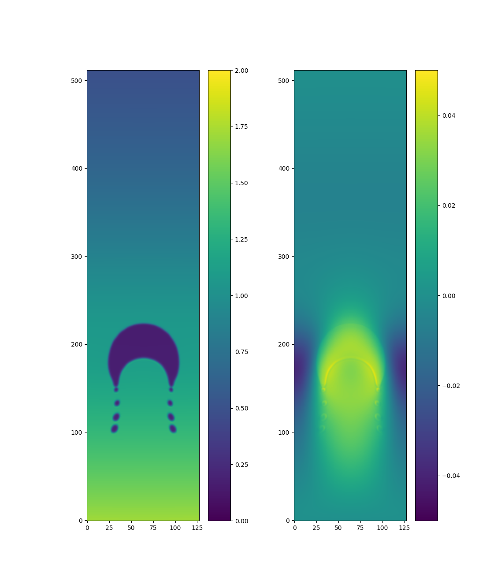

# Basic 2D Lattice Boltzmann Simulation

This project simulates fluids by dividing the simulation area into cells and tracking the velocity-distribution of the fluid inside each cell.

The method fits well for GPUs, but this implementation uses `numpy` and thereby runs on CPU. Be patient!

My goal was to implement a bunch of physical phenomena as best I can (and continue to do so), *not* break any speed records. Maybe precision records, one day ... ;)

## Development Strategy
I start from papers solving a particular challenge I encountered during development. (Sources coming soon!)

A fitting solution is tested for with a fresh test-scenario, initially with a simple setup, simulation loop and visual output. From here, implementation strategies are compared and testing-strategies developed. This process builds test and code in parallel.

The simulator is focused on highly readable, simple code. Precision and accuracy is a goal, though bare functionality is more important. Performance is not a concern.

## Running The Showcase
A simple showcase scenario is provided. It's an air bubble rising in a column of compressible fluid. This demonstrates the ability to simulate immiscible fluids of different density.

 1. clone this repo:

        git clone https://github.com/rocketcollider/simple_LBM
        cd simple_LBM

    optional: install virtual environment

        python3 -m venv venv             #optional
        . venv/bin/activate              #optional

 2. install dependencies:

        pip install -r requirements.txt

    **BEWARE** to install a [backend for matplotlib](https://matplotlib.org/stable/users/explain/figure/backends.html) as well! This depends on your operating system and requires additional packages to be installed. `requirements.txt` comes with `PyQt6` and `PyQt5`, resulting in `qtagg` for matplotlib. Other backends require additional pip *and* OS packages to be installed.

 3. run the showcase!

        python simshowcase.py 

    be patient! depending on your machine, this might take a while.

 4. enjoy the view!

    
    Roughly simulation-step 6000.

## Running The Tests
Install dependencies as described above. (testing- and production-dependencies are not separated right now)

Run `pytest` to run everything. But I recommend looking through the test-files first and running specific ones.

Most tests have options in the test-files, such as enabling visualization, running fast or precise tests, and so forth. I consider reading the test-file as part of the documentation.

## Theoretical Background
This simulator tries to approximate microscopic fluid behavior by dividing the fluid into very small volumes and treating these volumes as boxes full of fluid momentarily, i.e. solving the Navier Stokes equation locally.

Unique for this method (LBM) is to first calculate what happens to this box and then taking some of its content to another box.

### General LBM Method
Lattice Boltzmann Method solves the Navier Stokes equations by dividing the simulation area into cells and keeping track of fluid-momentum along predefined vectors. Calculating these momenta is usually referred to as "collision".

The magnitudes of these momenta are then transferred in their respective directions to a different cell. (usually neighboring cells, but couplings with farther removed cells exist) Each moment magnitude is stored in a fixed position in memory. As all momenta are transferred at the same time, the memory can simply be rearranged to achieve this "streaming".

This method is perfectly suited for GPU calculation, as all calculation happens purely locally. After streaming, each cell contains all information required to solve the equilibrium-distribution in that cell.

### Immiscible Fluids
To maintain a crisp interface between two immiscible fluids, an unphysical "recoloring" step is introduced. At the interface, a unit-velocity in the direction normal to the interface is added (or subtracted) to the momenta. That direction is determined by calculating the global gradient numerically.

### Gradients
Several body-forces require numerically calculating color- or density-gradients. This is done by correlating the fluid distribution with a 3x3 grid of weights, for which a Prewitt, Sobel and Scharr patern can be used, and more accurate but computationally more expensive 5x5 grids are an option which is required for the parallel pressure jump, as the 3x3 grid gradients caused self-amplifying oscillations. (empirical observation)

## Code structure
There are currently only two files

### `utils.py`
contains general tools and procedures.

Two methods to calculate gradients are present which should be equivalent and *will* be reduced to a single one in the future.

Functions that govern the transport of material are found here. Great care was taken the execution during simulation would be quick and all indices are calculated when the functions are invoked.

### `LBM.py`
contains the simulator as a class.

The base class `Flat_LBM` provides the absolute basic streaming capability, containing basic functionality as well as a simple test that looks for "leaks" through the boundary conditions. (i.e. it checks all momenta-vectors are accounted for, *NOT* that the total amount stays the same)

In `Compressible_Flow` physical quantities and processes are added that results in a full LBM simulator for single phase fluids.

With `Immiscib_LBM` functions that deal with an interface are added. Instead of tracking two fluids, a single phase is tracked for all momentum-relevant calculation as well as a secondary difference-field that allows keeping both phases separated.

Finally `DissimilarDensities_LBM` provides the ability to simulate phases of different densities. This requires changes to the `base_equilibrate` function as well as an option to take dissimilar speed of sounds into account.

At this moment, difference of two `Compressible_Flow` instances returns an `Immiscible_LBM` instance as a quality-of-life functionality. If this interface will be kept and expanded to `DissimilarDensities_LBM` instances or remove is not yet decided, use with caution!

## Sources
 - [Maini, Deepak. ‘VOF Based Multiphase Lattice Boltzmann Method ...’. 2007](https://api.semanticscholar.org/CorpusID:51765289): Provided the general implementation aproach, but contains many errors or missing steps.
 - [Ito et al. ‘Pressure Jump Conditions for Stokes Equations ...’. Methods and Applications of Analysis 13 (2006): 199–214](https://projecteuclid.org/journals/methods-and-applications-of-analysis/volume-13/issue-2/Pressure-Jump-Conditions-for-Stokes-Equations-with-Discontinuous-Viscosity-in2D/maa/1200694872.pdf): Provided interface pressure jump.
 - [Zahid et al. ‘Review of the Color Gradient Lattice Boltzmann Method .,..’. Fluids 10 (2025)](https://doi.org/10.3390/fluids10050128): Provided recoloring and relaxation-time interpolation.
 - [Leclaire et al. ‘Enhanced Equilibrium Distribution Functions ...’. International Journal of Multiphase Flow 57 (2013)](https://doi.org/10.1016/j.ijmultiphaseflow.2013.07.001): Provided the equilibration-corrections for density-differences.
 - Gunstensen et al. ‘Lattice Boltzmann Model of Immiscible Fluids’. Physical Review A 43 (1991)](https://doi.org/10.1103/physreva.43.4320): Develops the method on a hex-grid and provided better insight to the method.
